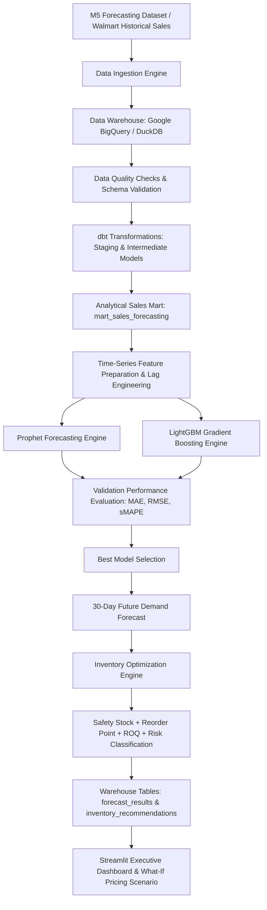

# Retail Demand Forecasting & Inventory Optimization

An end-to-end enterprise-grade retail demand forecasting and inventory replenishment optimization system using the **M5 Forecasting Dataset (Walmart historical sales)** built with **Python**, **SQL**, **Google BigQuery**, **DuckDB**, **dbt**, **Prophet**, **LightGBM**, and **Streamlit**.

---

## 📌 Problem Statement

In retail operations, accurate demand forecasting and optimal inventory replenishment are critical to maximizing revenue and minimizing holding costs. Under-forecasting leads to stockouts, missed sales, and customer churn, while over-forecasting results in excessive capital tie-up and storage overhead.

This project delivers an end-to-end automated system that ingests historical retail sales, performs transformation and data quality assertions via **dbt**, fits competitive forecasting models (**Prophet** and **LightGBM**), evaluates predictions against actual validation data, generates a **30-day future demand forecast**, and computes mathematical **safety stock, reorder points, and recommended order quantities**.

---

## 🏗 System Architecture



---

## 🛠 Technology Stack

- **Core Language**: Python 3.10+ & SQL
- **Data Warehouse**: Google BigQuery (Production) / DuckDB & SQLite (Local Fallback)
- **Data Transformation**: dbt (dbt-core, dbt-bigquery, dbt-duckdb)
- **Forecasting Models**: Prophet & LightGBM
- **Machine Learning & Evaluation**: scikit-learn, numpy, pandas, statsmodels
- **Executive Dashboard**: Streamlit & Plotly
- **Testing & Quality Assurance**: pytest & dbt generic assertions

---

## 📊 Data & dbt Transformation Pipeline

The data pipeline processes raw sales, calendar, and price data into a clean star-schema analytical dataset while preserving the full retail hierarchy:

$$\text{State} \longrightarrow \text{Store} \longrightarrow \text{Category} \longrightarrow \text{Department} \longrightarrow \text{Item}$$

### dbt Model Architecture

1. **Staging Models (`dbt/models/staging/`)**:
   - `stg_calendar`: Standardizes ISO sales dates, weekday keys, and event/SNAP flags.
   - `stg_sales`: Casts item, category, department, store, and state keys.
   - `stg_sell_prices`: Casts store, item, weekly key, and price values.
2. **Intermediate Models (`dbt/models/intermediate/`)**:
   - `int_daily_sales`: Joins sales facts with calendar events and weekly sell prices.
   - `int_weekly_sales` & `int_monthly_sales`: Aggregates temporal sales metrics.
3. **Analytical Marts (`dbt/models/marts/`)**:
   - `mart_sales_forecasting`: Consolidated, fully-indexed table prepared for time-series forecasting models.

---

## 🔮 Forecasting Engine: Prophet vs. LightGBM

The system implements a dual-model competitive forecasting framework:

### 1. Prophet Model
- Models non-linear trend, weekly seasonality, and yearly seasonality.
- Incorporates calendar regressors (`event_name_1`, `snap_ca`, etc.).
- Clips negative predictions to zero demand.

### 2. LightGBM Model
- Engineered time-series features computed strictly per `(store_id, item_id)` series:
  - **Lags**: `lag_1`, `lag_7`, `lag_14`, `lag_28`
  - **Rolling Windows**: 7-day and 28-day shifted rolling means & standard deviations (`rolling_mean_7`, `rolling_std_7`, `rolling_mean_28`, `rolling_std_28`)
  - **Calendar**: `year`, `month`, `day`, `day_of_week`, `week_of_year`, `is_weekend`
  - **Price**: `sell_price`
- Employs strict temporal train/validation split (no random splitting, zero target leakage).

---

## 📐 Model Evaluation & Selection

Models are evaluated on out-of-sample validation data using real calculated metrics:

$$\text{MAE} = \frac{1}{n} \sum |y - \hat{y}|$$

$$\text{RMSE} = \sqrt{\frac{1}{n} \sum (y - \hat{y})^2}$$

$$\text{sMAPE} = \frac{200\%}{n} \sum \frac{|y - \hat{y}|}{|y| + |\hat{y}| + \epsilon}$$

### Validation Benchmark Matrix

| Model | MAE | RMSE | sMAPE | Selection Status |
| :--- | :---: | :---: | :---: | :---: |
| **Prophet** | **2.25** | **2.81** | **35.77%** | 🏆 **WINNER (Selected)** |
| **LightGBM** | 2.33 | 2.91 | 36.14% | Runner-up |

The model achieving the lowest RMSE is automatically selected to generate the **30-day future demand forecast**, which is persisted to warehouse table `forecast_results`.

---

## 📦 Inventory Optimization Logic

### 1. Safety Stock ($SS$)
$$SS = Z \times \sigma_d \times \sqrt{L}$$
- **$Z$ (Service Level Factor)**: 1.65 (corresponds to a **95% target service level**).
- **$\sigma_d$**: Standard deviation of historical daily sales per item-store series.
- **$L$ (Lead Time)**: 7 days.

### 2. Reorder Point ($ROP$)
$$ROP = (\text{Avg Daily Forecast Demand} \times L) + SS$$

### 3. Recommended Order Quantity ($ROQ$)
$$ROQ = \max\left(0, \text{Total 30-Day Forecast Demand} + SS - I_{\text{avail}}\right)$$

> [!NOTE]
> The raw M5 dataset contains historical sales but does not track live real-time inventory levels. Initial available inventory ($I_{\text{avail}}$) is configured as a user/scenario parameter and clearly labeled as an assumption.

### 4. Stockout Risk Classification
- **HIGH**: $I_{\text{avail}} < SS$
- **MEDIUM**: $SS \le I_{\text{avail}} < ROP$
- **LOW**: $I_{\text{avail}} \ge ROP$

Recommendations are stored in warehouse table `inventory_recommendations`.

---

## 🖥 Streamlit Executive Dashboard

The presentation-ready Streamlit dashboard (`dashboard/app.py`) reads directly from `forecast_results` and `inventory_recommendations`:

1. **Dynamic Filters**: Filter by Store, Category, and Item.
2. **KPI Header Cards**: Total 30-Day Demand, Average Daily Demand, High Stockout Risk Count, Total Order Quantity.
3. **Historical vs. Forecast Chart**: Interactive Plotly chart contrasting past sales with 30-day predicted demand.
4. **30-Day Forecast Table**: Day-by-day projected units.
5. **Inventory Replenishment Recommendations**: Safety Stock, Reorder Point, Available Stock, Recommended Order Quantity, and Stockout Risk pill badges.
6. **What-If Price Scenario**: Interactive slider ($-10\%$, $0\%$, $+10\%$) estimating model-based demand responses.

---

## 🚀 Quickstart & Execution Guide

### 1. Environment Setup
```bash
# Clone repository
cd retail-demand-forecasting

# Install dependencies
pip install -r requirements.txt
```

### 2. Environment Configuration
Create a `.env` file (or copy `.env.example`):
```env
USE_LOCAL_DUCKDB=True
LOCAL_DUCKDB_PATH=data/m5_warehouse.duckdb
```

### 3. Run Complete End-to-End Pipeline
```bash
python run_pipeline.py --series-limit 10 --local
```

### 4. Run dbt Transformations & Tests Separately
```bash
dbt debug --project-dir dbt --profiles-dir dbt --target local
dbt build --project-dir dbt --profiles-dir dbt --target local
```

### 5. Run Pytest Suite
```bash
pytest tests/
```

### 6. Launch Executive Streamlit Dashboard
```bash
streamlit run dashboard/app.py
```

---

## ⚠️ Assumptions & Limitations

1. **Inventory Data**: The M5 dataset does not include live inventory balances; initial stock is treated as a scenario input.
2. **Lead Time & Service Level**: Fixed lead time of 7 days and 95% service level ($Z=1.65$) are assumed.
3. **What-If Pricing**: Price elasticity is a model-based estimation tool and does not establish formal econometric causality.
