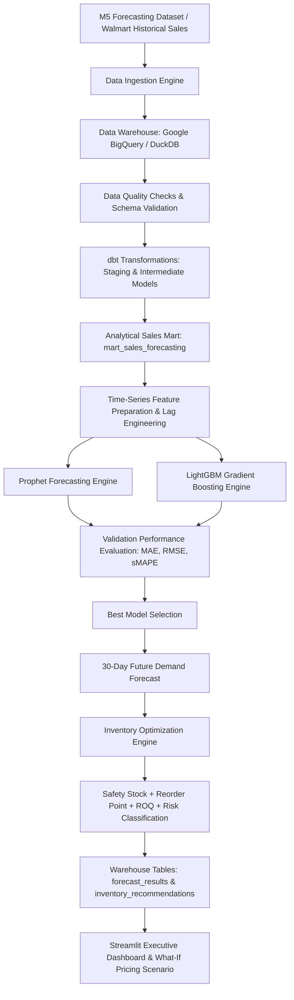

# Retail Demand Forecasting & Inventory Optimization

[](https://aryakadam07-retail-demand-forecasting-dashboardapp-pzpg9k.streamlit.app)
[](https://github.com/aryakadam07/retail-demand-forecasting)
[](https://github.com/aryakadam07/retail-demand-forecasting)

> 🌐 **Live Web Application**: [https://aryakadam07-retail-demand-forecasting-dashboardapp-pzpg9k.streamlit.app](https://aryakadam07-retail-demand-forecasting-dashboardapp-pzpg9k.streamlit.app)  
> 📊 **Data Warehouse**: Google BigQuery & DuckDB  
> 🤖 **ML Models**: Prophet & LightGBM Demand Forecasting Engine  

---

## 📌 Problem Statement

In retail operations, accurate demand forecasting and optimal inventory replenishment are critical to maximizing revenue and minimizing holding costs. Under-forecasting leads to stockouts, missed sales, and customer churn, while over-forecasting results in excessive capital tie-up and storage overhead.

This project delivers an end-to-end automated system that ingests historical retail sales (M5 Walmart dataset), performs transformation and data quality assertions via **dbt**, fits competitive forecasting models (**Prophet** and **LightGBM**), evaluates predictions against actual validation data, generates a **30-day future demand forecast**, and computes mathematical **safety stock, reorder points, and recommended order quantities**.

---

## 🏗 System Architecture



---

## 🛠 Technology Stack

- **Core Language**: Python 3.10+ & SQL
- **Data Warehouse**: Google BigQuery (Production) / DuckDB & SQLite (Local Fallback)
- **Data Transformation**: dbt (`dbt-core`, `dbt-bigquery`, `dbt-duckdb`)
- **Forecasting Models**: Prophet & LightGBM
- **Machine Learning & Evaluation**: `scikit-learn`, `numpy`, `pandas`, `statsmodels`
- **Executive Dashboard**: Streamlit & Plotly
- **Testing & Quality Assurance**: `pytest` & dbt generic assertions
- **Cloud Hosting**: Streamlit Community Cloud

---

## 📊 Data & dbt Transformation Pipeline

The data pipeline processes raw sales, calendar, and price data into a clean star-schema analytical dataset while preserving the full retail hierarchy:

$$\text{State} \longrightarrow \text{Store} \longrightarrow \text{Category} \longrightarrow \text{Department} \longrightarrow \text{Item}$$

### dbt Model Architecture

1. **Staging Models (`dbt/models/staging/`)**:
   - `stg_calendar`: Standardizes ISO sales dates, weekday keys, and event/SNAP flags.
   - `stg_sales`: Casts item, category, department, store, and state keys.
   - `stg_sell_prices`: Casts store, item, weekly key, and price values.
2. **Intermediate Models (`dbt/models/intermediate/`)**:
   - `int_daily_sales`: Joins sales facts with calendar events and weekly sell prices.
   - `int_weekly_sales` & `int_monthly_sales`: Aggregates temporal sales metrics.
3. **Analytical Marts (`dbt/models/marts/`)**:
   - `mart_sales_forecasting`: Consolidated, fully-indexed table prepared for time-series forecasting models.

---

## 🔮 Forecasting Engine: Prophet vs. LightGBM

The system implements a dual-model competitive forecasting framework:

### 1. Prophet Model
- Models non-linear trend, weekly seasonality, and yearly seasonality.
- Incorporates calendar regressors (`event_name_1`, `snap_ca`, etc.).
- Clips negative predictions to zero demand.

### 2. LightGBM Model
- Engineered time-series features computed strictly per `(store_id, item_id)` series:
  - **Lags**: `lag_1`, `lag_7`, `lag_14`, `lag_28`
  - **Rolling Windows**: 7-day and 28-day shifted rolling means & standard deviations (`rolling_mean_7`, `rolling_std_7`, `rolling_mean_28`, `rolling_std_28`)
  - **Calendar**: `year`, `month`, `day`, `day_of_week`, `week_of_year`, `is_weekend`
  - **Price**: `sell_price`
- Employs strict temporal train/validation split (no random splitting, zero target leakage).

---

## 📐 Model Evaluation & Selection

Models are evaluated on out-of-sample validation data using real calculated metrics:

$$\text{MAE} = \frac{1}{n} \sum |y - \hat{y}|$$

$$\text{RMSE} = \sqrt{\frac{1}{n} \sum (y - \hat{y})^2}$$

$$\text{sMAPE} = \frac{200\%}{n} \sum \frac{|y - \hat{y}|}{|y| + |\hat{y}| + \epsilon}$$

### Validation Benchmark Matrix

| Model | MAE | RMSE | sMAPE | Selection Status |
| :--- | :---: | :---: | :---: | :---: |
| **Prophet** | **2.20** | **2.73** | **37.31%** | 🏆 **WINNER (Selected)** |
| **LightGBM** | 2.23 | 2.79 | 37.63% | Runner-up |

The model achieving the lowest RMSE is automatically selected to generate the **30-day future demand forecast**, which is persisted to warehouse table `forecast_results`.

---

## 📦 Inventory Optimization Logic

### 1. Safety Stock ($SS$)
$$SS = Z \times \sigma_d \times \sqrt{L}$$
- **$Z$ (Service Level Factor)**: 1.65 (corresponds to a **95% target service level**).
- **$\sigma_d$**: Standard deviation of historical daily sales per item-store series.
- **$L$ (Lead Time)**: 7 days.

### 2. Reorder Point ($ROP$)
$$ROP = (\text{Avg Daily Forecast Demand} \times L) + SS$$

### 3. Recommended Order Quantity ($ROQ$)
$$ROQ = \max\left(0, \text{Reorder Point} - I_{\text{avail}}\right)$$

> [!NOTE]
> The raw M5 dataset contains historical sales but does not track live real-time inventory levels. Initial available inventory ($I_{\text{avail}}$) is configured as an interactive scenario parameter in the dashboard and clearly labeled as an assumption.

### 4. Stockout Risk Classification
- **HIGH**: $I_{\text{avail}} < ROP$
- **MEDIUM**: $ROP \le I_{\text{avail}} < ROP \times 1.25$
- **LOW**: $I_{\text{avail}} \ge ROP \times 1.25$

Recommendations are stored in warehouse table `inventory_recommendations`.

---

## 🖥 Streamlit Executive Dashboard

The presentation-ready Streamlit dashboard ([`dashboard/app.py`](file:///c:/Users/HP/OneDrive/Desktop/retail-demand-forecasting/dashboard/app.py)) reads directly from `forecast_results` and `inventory_recommendations`:

1. **Hero Obsidian Header**: Live status indicator (`🟢 SYSTEM LIVE`).
2. **Glassmorphism KPI Cards**: Total 30-Day Demand, Daily Run-Rate, High Risk SKU count, Total Reorder Qty.
3. **Tabbed Navigation**:
   - 📈 *Demand Forecast & Timeline*
   - 📦 *Inventory Replenishment & Stockout Risk Matrix*
   - 🏆 *ML Model Accuracy Benchmark*
4. **Live Parameter Controls**: Interactive sliders for Lead Time, Service Level %, and Initial Inventory.
5. **What-If Pricing Simulator**: Slider ($-10\%$, $0\%$, $+10\%$) estimating demand elasticity response.
6. **CSV Exports**: One-click download buttons for forecast schedule and purchase order recommendations.

---

## 🚀 Quickstart & Execution Guide

### 1. Environment Setup
```bash
# Clone repository
git clone https://github.com/aryakadam07/retail-demand-forecasting.git
cd retail-demand-forecasting

# Install dependencies
pip install -r requirements.txt
```

### 2. Environment Configuration
Create a `.env` file (or copy `.env.example`):
```env
USE_LOCAL_DUCKDB=True
LOCAL_DUCKDB_PATH=data/m5_warehouse.duckdb
BIGQUERY_DATASET=retail_m5_dw
```

### 3. Run Complete End-to-End Pipeline
```bash
python run_pipeline.py
```

### 4. Run Data Ingestion & BigQuery Upload
```bash
python src/data_ingestion/bigquery_ingestion.py
```

### 5. Run dbt Transformations & Tests
```bash
dbt debug --project-dir dbt --profiles-dir dbt --target local
dbt build --project-dir dbt --profiles-dir dbt --target local
```

### 6. Launch Streamlit Executive Dashboard
```bash
streamlit run dashboard/app.py
```

---

## 📄 License & Acknowledgements

- **Dataset**: Walmart M5 Forecasting Competition (Kaggle / University of Nicosia)
- **License**: MIT License
